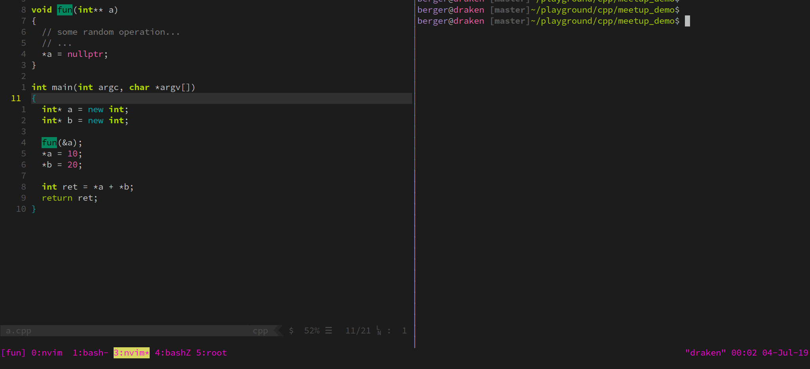
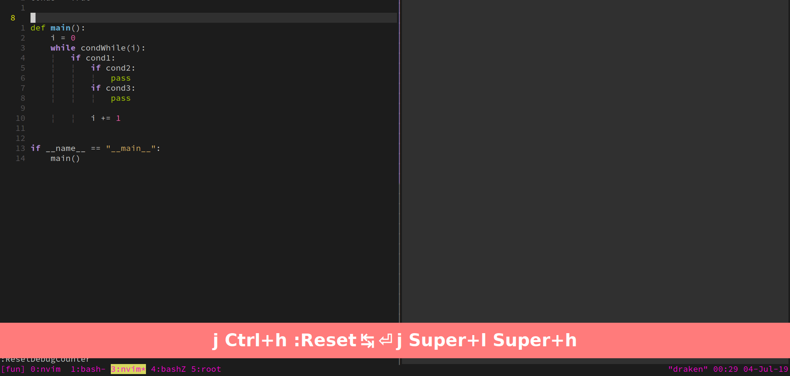
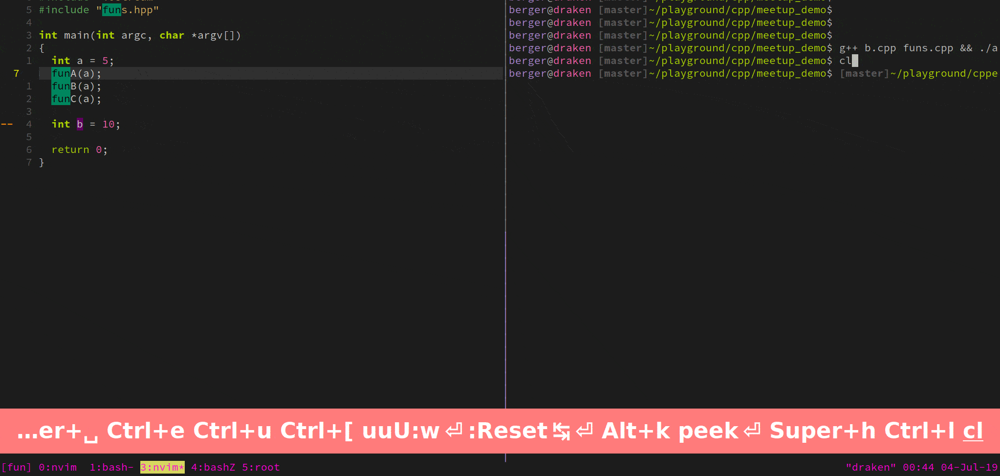

# vim-debugstring

<p align="center">
  <a href="https://travis-ci.org/bergercookie/vim-debugstring" alt="Build Status">
  </a>
</p>

```
     _      _                     _        _
    | |    | |                   | |      (_)
  __| | ___| |__  _   _  __ _ ___| |_ _ __ _ _ __   __ _
 / _` |/ _ \ '_ \| | | |/ _` / __| __| '__| | '_ \ / _` |
| (_| |  __/ |_) | |_| | (_| \__ \ |_| |  | | | | | (_| |
 \__,_|\___|_.__/ \__,_|\__, |___/\__|_|  |_|_| |_|\__, |
                         __/ |                      __/ |
                        |___/                      |___/

```

## Purpose

`debugstring` aims to automate standard debugging operations (e.g., segfaults).
It does that by facilitating the ubiquitous
[printf()-debugging](https://everything2.com/title/printf%28%29%20debugging)
i.e., scatter logging statements around the various code snippets that you want
to test.


## Demos

[Presentation at Vim-London](https://www.youtube.com/watch?v=cJIoH5r2zSk)

### Finding a segfault



### Control flow



### Expression evaluation



## Features

- The form and syntax of the logging statements target the language at hand
(e.g., use `printf()` in C/C++ but `puts()` in Ruby)
- Support for debugging variable expressions e.g., the values of variables or
    arbitrary expressions at certain parts of your code
- Support for <cexpr>: Place your cursor over the variable you want to print and
    press `<leader>DS`. It will create a debugging string for that variable
- Support for [vim-repeat](https://github.com/tpope/vim-repeat). No
    need for repeat the same mapping, or rewrite the lengthy expression that you
    want to monitor, just use the `.` character


Currently the following languages are supported. First column corresponds to the
standard debugging string while the second to the case of debugging for a
specific variable.

Lang         | Debug String       | Debug Variable
---          | ---                | ---
Arduino      | :heavy_check_mark: | :heavy_check_mark:
Awk          | :x:                | :x:
C            | :heavy_check_mark: | :heavy_check_mark:
C#           | :heavy_check_mark: | :heavy_check_mark:
C++          | :heavy_check_mark: | :heavy_check_mark:
CMake        | :heavy_check_mark: | :heavy_check_mark:
D            | :x:                | :x:
Dockerfile   | :heavy_check_mark: | :heavy_check_mark:
Fish-Shell   | :heavy_check_mark: | :heavy_check_mark:
Fortran      | :heavy_check_mark: | :heavy_check_mark:
Go           | :heavy_check_mark: | :heavy_check_mark:
Haskell      | :heavy_check_mark: | :heavy_check_mark:
Java         | :heavy_check_mark: | :heavy_check_mark:
Javascript   | :heavy_check_mark: | :heavy_check_mark:
Julia        | :x:                | :x:
Lua          | :heavy_check_mark: | :heavy_check_mark:
Makefile     | :heavy_check_mark: | :heavy_check_mark:
Matlab       | :x:                | :x:
PHP          | :heavy_check_mark: | :heavy_check_mark:
Perl         | :x:                | :x:
Python       | :heavy_check_mark: | :heavy_check_mark:
R            | :heavy_check_mark: | :heavy_check_mark:
Ruby         | :heavy_check_mark: | :heavy_check_mark:
Rust         | :heavy_check_mark: | :heavy_check_mark:
Scala        | :x:                | :x:
Shell        | :heavy_check_mark: | :heavy_check_mark:
Swift        | :x:                | :x:
Vim          | :heavy_check_mark: | :heavy_check_mark:
Visual Basic | :x:                | :x:
Zsh          | :heavy_check_mark: | :heavy_check_mark:

For a more detailed description of `debugstring` check
[doc/debugstring.txt](https://github.com/bergercookie/vim-debugstring/blob/master/doc/debugstring.txt)

## Usage

Use the mappings of your choice to place unique logging directives during
debugging times.

```vim
nnoremap <your-key-combination> <Plug>DumpDebugString
nnoremap <a-second-key-combination> <Plug>DumpDebugStringExpr
nnoremap <a-third-key-combination> <Plug>DumpDebugStringCexpr
```

Default mappings are: `<Leader>ds`, `<Leader>dS`, `<Leader>DS` respectively.

An example of using it in a C++ file is given below:

```c++
// Debug String
std::cout << "[a.c:4] DEBUGGING STRING ==> " << 0 << std::endl;

// Debug Variable
std::cout << "[a.c:4] a_variable: " << a_variable << std::endl;
```

### Remarks - Debugging

* Make sure that `filetype plugin` is enabled. A line like `filetype plugin on` in
    your `.vimrc` should do the job.


## Installation

| Plugin manager | How to install |
| :------------- | :------------- |
| [Dein][1] | `call dein#add('bergercookie/vim-debugstring')` |
| [minpac][2] | `call minpac#add('bergercookie/vim-debugstring')` |
| [Pathogen][3] | `git clone https://github.com/bergercookie/vim-debugstring.git ~/.vim/bundle/vim-debugstring` |
| [Plug][4] | `Plug 'bergercookie/vim-debugstring'` |
| [Vundle][5] | `Plugin 'bergercookie/vim-debugstring'` |
| manual | copy all of the files into your `.vim` directory (or `~/.config/nvim` if you're using neovim)|

[1]: https://github.com/Shougo/dein.vim
[2]: https://github.com/k-takata/minpac
[3]: https://github.com/tpope/vim-pathogen
[4]: https://github.com/junegunn/vim-plug
[5]: https://github.com/VundleVim/Vundle.vim

### Dependencies

`debugstring` depends on the following vim plugins:

- vim-repeat [OPTIONAL]

## Contributing

In case you want to contribute on a certain feature/fix, don't hesitate to
discuss about it in the Github issues or to implement it and make a PR.

## License

Current plugin is distributed under the same terms as Vim itself. See the
[LICENSE](https://github.com/bergercookie/vim-debugstring/blob/master/LICENSE)
file

## Self Promotion

In case you like the plugin, you might as well [star it on
Github](https://github.com/bergercookie/vim-debugstring) or [rate it on
vim.org](https://vim8.org/scripts/script.php?script_id=5634) Also feel
free to check my [other
plugins](https://github.com/bergercookie?tab=repositories)

## Notes on Development

This mostly comprises a list of stuff I want to keep track of when developing
this or other vim plugins

* Use [vimdoc](https://github.com/google/vimdoc) to generate documentation from
    the `vim` docstring (instead of manually updating the .txt file). See the
    misc/build_doc for more on how this is done.
* Use [vader](https://github.com/junegunn/vader.vim) for unittesting. Use
    `test/run-tests.sh` to run them:

    ```
    vim -Nu test/vimrc
    :set rtp+=vader.vim/plugin
    :set rtp+=vim-repeat/autoload

    :Vader test/*
    ```
## TODO

- [ ] Method to delete all the debugging strings in current buffer / all "touched" buffers - see far.vim
- [x] Method to print name and contents of a variable
- ~[ ]Make the counter buffer-specific~ Nope, we already have the filename &
    line for file-specific text
- [ ] Escape double single quotes vimscript variable printing
- [x] Append to current line if that is empty
- [x] Support repeat.vim
- [x] Use an assertion module - vader
- [x] Use vader.vim for TDD
- [x] Extend vader support for rest of languages
- [x] Use travis for CI
- [x] Bug with changing the filename of the current file
- [x] Make vim-repeat dependency optional
- [x] Turn supported languages into a table - what do we support in which
    language
- [x] Make vim-repeat dependency optional
